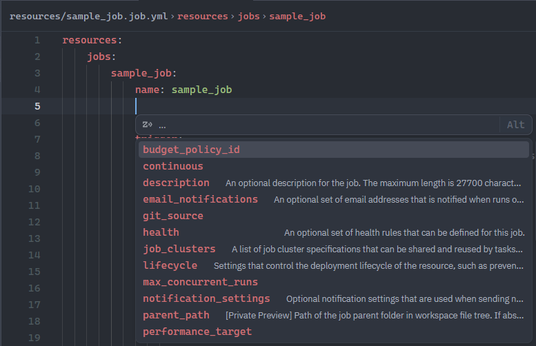
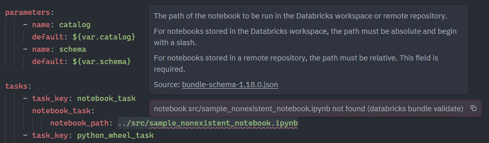
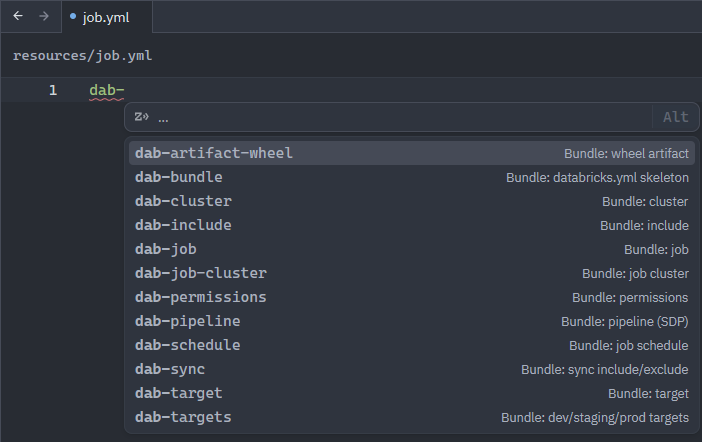
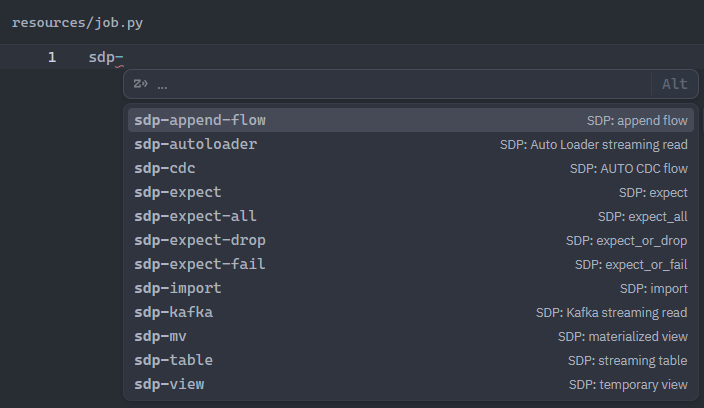

# Databricks for Zed

[](https://github.com/bartoszgajda55/zed-databricks/actions/workflows/ci.yml)
[](https://github.com/bartoszgajda55/zed-databricks/releases/latest)
[](LICENSE)

Zed tooling for Databricks development: **Declarative Automation Bundles** (DABs, formerly Databricks Asset Bundles), **Spark Declarative Pipelines** (SDP, formerly Delta Live Tables) and **PySpark**.

Zed has no webview or panel API, so instead of a workspace browser you get editor knowledge (schema, diagnostics, type stubs, snippets) plus tasks and debugging. Every piece wraps the `databricks` CLI, so authentication, profiles and targets behave as they do in your terminal.

> A community project, not affiliated with or endorsed by Databricks, Inc. Databricks is a trademark of Databricks, Inc.





## Features

**In the extension** (install from Zed's extension gallery):

| Feature | What you get |
| --- | --- |
| Bundle schema | Completion, validation and hover docs in a bundle's `databricks.yml`, `*.bundle.yml` and `resources/**/*.yml`. The schema comes from *your installed* CLI, and other YAML is left alone. |
| Bundle diagnostics | `databricks bundle validate` runs on open and save (through `databricks-bundle-ls`), and its errors and warnings appear at the reported file and line, for the active target and profile. |
| Snippets | 38 snippets: `dab-*` for bundle YAML, `sdp-*` for pipelines in Python and SQL, `pyspark-*` for tests. |

**Project templates** (optional, copied into a project by `scripts/setup-project.sh`):

| Feature | What you get |
| --- | --- |
| Python types | basedpyright understands the Databricks-only pipeline API (`expect*`, SCD type 2 AUTO CDC, …) and the runtime globals `spark`, `dbutils` and `display`. |
| Ruff | Format on save, organized imports, and no F821 errors on `spark` / `dbutils` / `display`. |
| Tasks | `bundle validate / plan / deploy / run / open / summary / destroy`, pipeline dry-runs and logs on Databricks, local Spark pipeline runs, `environments setup-local`, `auth`, `pytest`. |
| Debugging | Breakpoints in driver-side PySpark with Zed's Debugpy adapter, while Spark runs on the bundle target's cluster or on serverless through Databricks Connect. |

## Install

Prerequisite: the [Databricks CLI](https://docs.databricks.com/dev-tools/cli/install.html), authenticated with `databricks auth login` or a `~/.databrickscfg` profile. The extension works with any recent version; the tasks use commands from v1.9.0 onwards, and the latest version is recommended.

1. **Extension.** In Zed, open `zed: extensions`, search for **Databricks** and install it. On first use it downloads its diagnostics server, `databricks-bundle-ls`, from the GitHub release matching the extension's version.
   - To use your own build of the server instead, put it on `PATH` (for example `cargo install --git https://github.com/bartoszgajda55/zed-databricks --tag v<version> databricks-bundle-ls`) or set `lsp.databricks-bundle-ls.binary.path`.
   - To install from source, clone this repository, run `zed: install dev extension` and pick the directory. Zed compiles the extension itself, which needs `rustup` where Zed runs (see [CONTRIBUTING.md](CONTRIBUTING.md)).
2. **Project templates (optional).** Copy the tasks, debug scenarios, settings and Python stubs into a project. This needs a clone of this repository and a POSIX shell (macOS, Linux, or WSL / Git Bash on Windows):
   ```sh
   git clone https://github.com/bartoszgajda55/zed-databricks.git
   zed-databricks/scripts/setup-project.sh /path/to/your/project
   ```
   The script never overwrites existing files:
   - **`.zed/settings.json`:** if you already have one, the template's settings are merged in. Settings you already have win, and your original file is kept as `.zed/settings.json.bak`, because the merged file is written as plain JSON without comments. This needs `python3`; without it, or if your file can't be parsed, the template is written alongside instead.
   - **Other files:** when one already exists, the template is written alongside it (for example `databricks.tasks.json`) for you to merge by hand.

## Usage

### Target and profile

Everything reads the same two variables, so set them once in the project's `.zed/settings.json`:

```jsonc
"terminal": { "env": { "DATABRICKS_BUNDLE_TARGET": "staging", "DATABRICKS_CONFIG_PROFILE": "staging" } }
```

The tasks and terminals use them through the environment. `databricks-bundle-ls` reads the same file, and each diagnostic's source shows the target, for example `databricks bundle validate (target: staging)`. If you leave them unset, the CLI uses the target marked `default: true` and the `DEFAULT` profile. To use a different target or profile for diagnostics only, set `target` / `profile` in the language server's settings (see [Diagnostics](#diagnostics)).

### Schema

The extension runs `databricks bundle schema` once per CLI version and points yaml-language-server at the result. Restart Zed after upgrading the CLI. Without a local CLI, it falls back to the schema of the latest CLI release.

The schema applies to worktrees whose root contains `databricks.yml`, and only to that bundle's files. If your bundles live in subdirectories, list them:

```jsonc
"lsp": { "databricks-bundle-ls": { "settings": { "bundleRoots": ["bundles/etl", "bundles/ml"] } } }
```

An empty list turns the schema off. If you map a Databricks schema yourself in `lsp.yaml-language-server.settings.yaml.schemas`, the extension leaves that mapping alone.

### Diagnostics

`databricks-bundle-ls` starts with YAML files. Inside a bundle (any directory tree with `databricks.yml`) it runs `databricks bundle validate` when a bundle file is first opened and on every save; elsewhere it stays idle. If the CLI fails without an error it can place, for example when it crashes, the failure is shown on `databricks.yml` rather than hidden. To turn the server off for a project:

```jsonc
"languages": { "YAML": { "language_servers": ["!databricks-bundle-ls", "..."] } }
```

Settings go under `lsp.databricks-bundle-ls.settings` (`initialization_options` is also read, with `settings` taking precedence). Invalid values are reported in the language server log and the previous settings are kept.

```jsonc
"lsp": { "databricks-bundle-ls": { "settings": { "target": "dev", "validateOnOpen": false } } }
```

| Setting | Default | Effect |
| --- | --- | --- |
| `target` | `DATABRICKS_BUNDLE_TARGET`, then `terminal.env` | Bundle target to validate |
| `profile` | `DATABRICKS_CONFIG_PROFILE`, then `terminal.env` | CLI profile |
| `databricksPath` | `databricks` on `PATH` | CLI to run |
| `strict` | `false` | Pass `--strict`, so warnings fail validation |
| `timeoutSeconds` | `120` | Stop a validation that takes longer |
| `validateOnOpen` | `true` | `false` validates on save only |
| `bundleRoots` | the worktree root, if it has `databricks.yml` | Bundles whose files get the schema (see [Schema](#schema)) |

**What runs automatically.** Validation runs the Databricks CLI in the bundle, and bundles that define resources in Python run that project code too. Zed only starts language servers and applies a project's `.zed/settings.json` once you [trust the project](https://zed.dev/docs/worktree-trust), so this doesn't happen for a freshly cloned, untrusted repository. Set `validateOnOpen` to `false` to validate only when you save.

### Snippets

<p>
  
  
</p>

Type a prefix and accept it from the completion list; Tab moves between placeholders. Snippets marked **Databricks only** use syntax OSS Spark lacks (expectations, Auto Loader / `read_files`, SQL `AUTO CDC`). The CDC snippets default to SCD type 1, the only type OSS Spark supports.

<details>
<summary>All 38 snippets</summary>

**Bundle YAML**

| Prefix | Inserts |
| --- | --- |
| `dab-bundle` | Minimal `databricks.yml` with include, variables and dev/prod targets |
| `dab-job` | Job resource with a serverless Python file task |
| `dab-task` | Job task entry (notebook task, depends on another task) |
| `dab-task-pipeline` | Job task that triggers a bundle-managed pipeline |
| `dab-schedule` | Quartz cron schedule for a job |
| `dab-job-cluster` | Job cluster definition governed by a cluster policy |
| `dab-cluster` | All-purpose cluster resource governed by a cluster policy |
| `dab-pipeline` | Serverless Spark Declarative Pipeline resource |
| `dab-variable` | Bundle variable with a default |
| `dab-variable-lookup` | Bundle variable resolved by name lookup (e.g. a cluster policy ID) |
| `dab-target` | Single deployment target |
| `dab-targets` | Standard dev / staging / prod target set |
| `dab-permissions` | Permissions block (users / groups / service principals) |
| `dab-sync` | Which local files are synced to the workspace |
| `dab-artifact-wheel` | Build a Python wheel as part of deploy |
| `dab-include` | Include additional bundle configuration files |

**Pipelines (Python)**

| Prefix | Inserts |
| --- | --- |
| `sdp-import` | Import the Spark Declarative Pipelines Python API |
| `sdp-table` | `@dp.table`: streaming table fed by a streaming read |
| `sdp-mv` | `@dp.materialized_view`: batch-recomputed dataset |
| `sdp-view` | `@dp.temporary_view`: pipeline-scoped view, not published |
| `sdp-autoloader` | Streaming table ingesting files with Auto Loader (Databricks only) |
| `sdp-kafka` | Streaming table reading from Kafka |
| `sdp-append-flow` | Streaming table with a flow appending into it |
| `sdp-cdc` | `dp.create_auto_cdc_flow`: CDC into an SCD 1 / SCD 2 target |
| `sdp-expect`, `sdp-expect-drop`, `sdp-expect-fail`, `sdp-expect-all` | Expectations: keep, drop or fail on violations, or several at once (Databricks only) |

**Pipelines (SQL)**

| Prefix | Inserts |
| --- | --- |
| `sdp-st` | `CREATE STREAMING TABLE … AS SELECT FROM STREAM` |
| `sdp-st-files` | Streaming table ingesting files with `read_files` (Databricks only) |
| `sdp-mv` | `CREATE MATERIALIZED VIEW` |
| `sdp-view` | `CREATE TEMPORARY VIEW` scoped to the pipeline |
| `sdp-st-expect`, `sdp-expect` | Streaming table with a `CONSTRAINT … EXPECT`, or the clause alone (Databricks only) |
| `sdp-cdc` | `AUTO CDC INTO`: CDC into an SCD 1 / SCD 2 target (Databricks only) |
| `sdp-append-flow` | `CREATE FLOW … AS INSERT INTO` a streaming table |

**Tests (Python)**

| Prefix | Inserts |
| --- | --- |
| `pyspark-fixture` | Session-scoped local SparkSession fixture for pytest (no cluster, no cost) |
| `pyspark-test` | pytest test comparing DataFrames with chispa |

</details>

### Tasks

Open them with `task: spawn`. Tasks that work on the bundle run through `.zed/databricks/cli.sh`, which prints the active target and profile first, then runs the `databricks` command.
- **`bundle run (pick resource)`** / **`bundle open (pick resource)`**: the CLI prompts you for a resource to run, or to open in the browser.
- **`bundle run "…"`**: runs the resource key currently selected in the editor.
- **`bundle destroy`**: always asks for confirmation.
- **`pipelines dry-run on Databricks`**: checks the *deployed* pipeline's graph on Databricks, including Databricks-only features, without materializing data. **`pipelines logs`** shows the events of its latest update.
- **`sdp: … on local Spark`**: run or dry-run a pipeline spec with open-source Spark on your machine. It's free, but can't check Databricks-only syntax.
- **`environments setup-local`**: creates or updates the project's `.venv` to match your compute, with the same Python version and a compatible `databricks-connect` (uses uv; see [Debugging](#debugging-with-databricks-connect)). One task uses the bundle target's cluster; the other uses serverless, version `DATABRICKS_SERVERLESS_VERSION` (default 5).
- **`sdp` / `pytest`**: use the project's `.venv/bin` when it exists.

### Python

- **Stubs:** `typings/pyspark-stubs` is a *partial* stub package. It adds the Databricks API to `pyspark.pipelines` (expectations, `create_auto_cdc_flow` with SCD type 2 and history tracking, snapshot CDC, sinks, and extra dataset options) without shadowing the rest of PySpark.
- **Runtime globals:** `__builtins__.pyi` defines `spark` and `sc`. It also defines `dbutils`, `display` and `displayHTML`, which are fully typed when `databricks-sdk` or `databricks-connect` is installed. Projects created with `databricks bundle init` include the same file as `.vscode/__builtins__.pyi`, set up for VS Code; the template puts it at the project root, where basedpyright in Zed looks for it.
- **Legacy `import dlt` code:** install Databricks' `databricks-dlt` package.

### Debugging with Databricks Connect

Press F4 and choose **Databricks Connect: debug current file**, or **debug pytest (current file)**. Driver-side code runs locally under debugpy, so breakpoints, stepping and the debug console work as usual. Spark operations run remotely. Code inside UDFs runs on the cluster, so breakpoints there won't stop.

`connect_runner.py` creates the Databricks Connect session before running your file. It also provides `spark`, `dbutils` and `display`, so notebook-style scripts run unchanged, and `SparkSession.builder.getOrCreate()` returns the same session.

Compute and profile use Databricks Connect's own configuration: `DATABRICKS_CONFIG_PROFILE`, `DATABRICKS_CLUSTER_ID`, `DATABRICKS_SERVERLESS_COMPUTE_ID=auto`, or `cluster_id` / `serverless_compute_id` in the `~/.databrickscfg` profile. The runner only fills in what isn't configured:
- **Profile and target:** from `.zed/settings.json` `terminal.env`, the same ones the tasks and diagnostics use.
- **Compute:** the bundle target's `cluster_id`, otherwise serverless.

Set up the project's Python environment with the task **databricks: environments setup-local** (serverless, or the bundle target's cluster). It runs `databricks environments setup-local` (CLI v1.9.0+), which uses uv to create `.venv` with the Python version and a `databricks-connect` that match your compute. Zed then picks up `.venv` for debugging. If uv isn't installed, install it or set `DATABRICKS_LOCALENV_AUTO_INSTALL_UV=1` to let the CLI install it.

The same runner is available without the debugger as the task **databricks-connect: run current file**.

### CI/CD

Databricks documents bundle pipelines for [GitHub Actions](https://docs.databricks.com/aws/en/dev-tools/ci-cd/github) (with [workload identity federation](https://docs.databricks.com/aws/en/dev-tools/auth/provider-github), so no stored secrets) and [Azure DevOps](https://learn.microsoft.com/en-us/azure/databricks/dev-tools/ci-cd/azure-devops).

### AI agents

This extension and Databricks' agent skills complement each other:
- **The skills give the agent knowledge.** Databricks' skills teach an agent how to write bundles, pipelines, jobs and more (`databricks-dabs`, `databricks-pipelines`, …), driving the `databricks` CLI.
- **The extension gives the agent feedback.** Schema errors and `databricks bundle validate` results appear as diagnostics, which Zed's agent reads. So it sees what's wrong in a bundle file it just edited, and fixes it.

For Claude Code, Codex, Cursor and the other agents Databricks supports, install the skills with the CLI. Claude Code and Codex also run inside Zed's agent panel.

```sh
databricks aitools install
```

`aitools` doesn't list Zed's own agent yet, but Databricks' skills already use the standard `SKILL.md` format Zed reads, and Zed loads them from `~/.agents/skills/` (or `.agents/skills/` in a project). Write them there with the CLI (v1.6.0 or later), and run it again to update:

```sh
databricks aitools install --path ~/.agents/skills
```

In PowerShell on Windows, use `--path $HOME\.agents\skills`.

For agents working with data rather than code, see Databricks' [managed MCP servers](https://docs.databricks.com/aws/en/agents/mcp-tools/managed-mcp).

## Troubleshooting

The language server's log is under `dev: open language server logs` → `databricks-bundle-ls`: it records each validation with its target, and any settings errors.

| Symptom | Cause and fix |
| --- | --- |
| No diagnostics or completion at all | The project isn't trusted yet: Zed's Restricted Mode starts no language servers. Trust it from the title bar's warning icon. |
| `cannot resolve bundle auth configuration: … multiple profiles matched` | Several `~/.databrickscfg` profiles point at the same workspace. Set `DATABRICKS_CONFIG_PROFILE` in `.zed/settings.json` (see [Target and profile](#target-and-profile)), or remove the duplicates. |
| `` failed to start `databricks` `` on `databricks.yml` | The CLI isn't on the `PATH` Zed sees. Install it, restart Zed, or set `databricksPath`. |
| No completion in `resources/` files | The worktree root has no `databricks.yml`. List your bundles in `bundleRoots` (see [Schema](#schema)). |
| Completion doesn't match a new CLI version | Restart Zed after upgrading the CLI. |
| `could not download databricks-bundle-ls` | No network, or GitHub's API rate limit. Previously downloaded versions are reused automatically; otherwise install the server yourself (see [Install](#install)). |
| `zed: install dev extension` fails on Windows with a WSL project | Zed compiles dev extensions on Windows: install Rust for Windows and build from a Windows-side clone (see [CONTRIBUTING.md](CONTRIBUTING.md)). |

## Support

Questions, bugs and ideas: [GitHub issues](https://github.com/bartoszgajda55/zed-databricks/issues). Please report security problems privately, as described in [SECURITY.md](SECURITY.md).

## Contributing

Contributions are welcome. See [CONTRIBUTING.md](CONTRIBUTING.md) for setup, tests and releases, and [docs/design-notes.md](docs/design-notes.md) for the Zed, CLI and Spark behaviour behind the design. Changes are listed in [CHANGELOG.md](CHANGELOG.md).

## License

[MIT](LICENSE)
